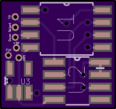
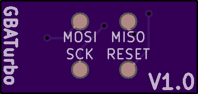

# GBATurbo
Cheap DIY game speed adjuster for the GBA

The entire pcb and it's components come in at around 5.50 USD

The PCB measures 20.5 by 9.8 mm.

[OSHPark Project](https://www.oshpark.com/shared_projects/w5yUIHU1)

**Front**

**Back**

Note: These are untested, and no flashable code has been written for the ATtiny85

BOM:

**U1:** [ATtiny85-20SUR](https://www.arrow.com/en/products/attiny85-20sur/microchip-technology)

**U2:** [MCP4151-503E](https://www.arrow.com/en/products/mcp4151-503esn/microchip-technology)

**U3:** [LTC1799CS5](https://www.arrow.com/en/products/ltc1799cs5trmpbf/analog-devices)

**C1:** [Capacitor 0603 0.1uF](https://www.arrow.com/en/products/c0603x104k3ractu/kemet-corporation)

## Flashing with an arduino

### Requirements

* An Arduino (yes really)
* A 10uF/25V Capacitor to bridge GND & Reset on the Arduino
* The Arduino Software

### Pinout

|  Name | Arduino | GBATurbo |
|:-----:|:-------:|:--------:|
| Reset |    10   |    Reset   |
|  MOSI |    11   |   MOSI   |
|  MISO |    12   |   MISO   |
|  SCK  |    13   |    SCK   |
|  VCC  |   +5V   |    VCC   |
|  GND  |   GND   |    GND   |

4. Under tools set up the following settings.

|  Setting |  Value  |
|:-----:|:-------:|
|  Board  |    ATtiny25/45/85   |
|  Processor |    Atiny85   |
|  Clock |    Internal 8 MHz   |
|  Port  |    COMX (Arduino *)   |
|  Programmer  |   Arduino as ISP   |
