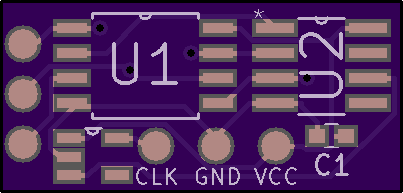

# GBATurbo
Cheap DIY game speed adjuster for the GBA

Cost is about 8 USD.

[OSHPark Project](https://www.oshpark.com/shared_projects/WZH41CYL)

** Front **


** Back **


Note: These are untested, and no flashable code has been written for the ATtiny85

Part List:

[MCP4151-503E](https://www.digikey.com/short/jw8d82)

[ATtiny85-20SUR](https://www.digikey.com/short/jw8dpp)

[LTC1799HS5](https://www.digikey.com/short/jw8dzf)


## Flashing with an arduino

### Requirements


* An Arduino (yes really)
* A 10uF/25V Capacitor to bridge GND & Reset on the Arduino
* The Arduino Software

### Pinout

|  Name | Arduino | GBATurbo |
|:-----:|:-------:|:--------:|
| Reset |    10   |    RST   |
|  MOSI |    11   |   MOSI   |
|  MISO |    12   |   MISO   |
|  SCK  |    13   |    SCK   |
|  VCC  |   +5V   |    VCC   |
|  GND  |   GND   |    GND   |

### Flashing the Attiny85

1. Open Ardiuno IDE and click "File > Preferences" and paste this url ```https://raw.githubusercontent.com/damellis/attiny/ide-1.6.x-boards-manager/package_damellis_attiny_index.json``` into "Additional board manager urls"

2. Go to Tools > Board > Manager and find "ATTiny" and install it.

3. Connect your arduino based on the pins listed above, don't forget the 10uF capacitor to bridge GND & Reset on the arduino. (Make sure the anode goes to ground)

4. Under tools set up the following settings.

|  Setting |  Value  |
|:-----:|:-------:|
|  Board  |    ATtiny25/45/85   |
|  Processor |    Atiny85   |
|  Clock |    Internal 8 MHz   |
|  Port  |    COMX (Arduino *)   |
|  Programmer  |   Arduino as ISP   |
